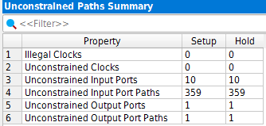

# VLSI FPGA Streaming System

A dual-clock FPGA streaming system implemented in SystemVerilog and targeting the Intel Cyclone IV E FPGA.

The design processes 8-bit input samples using a 4-tap FIR filter, transfers the filtered 16-bit data safely between asynchronous clock domains using an asynchronous FIFO, and transmits the results through a UART transmitter.

The project also implements dynamic power reduction using hardware clock gating with Intel `ALTCLKCTRL`. After 10 consecutive inactive `clk_fast` cycles, the FIR clock is disabled. A wake-up mechanism preserves the first incoming sample while the gated clock is restarted.

The complete design was synthesized, fitted, functionally verified, analyzed using TimeQuest Static Timing Analysis, and evaluated using Quartus Power Analyzer.

---

## Key Results

| Metric | Result |
|---|---:|
| Target FPGA | Intel Cyclone IV E `EP4CE115F29C7` |
| Fast Clock | 100 MHz |
| Slow Clock | 10 MHz |
| UART Baud Rate | 9600 |
| FIR Taps | 4 |
| FIR Coefficients | `[1, 2, 3, 4]` |
| Worst Setup Slack | `+1.450 ns` |
| Worst Hold Slack | `+0.180 ns` |
| Design-wide TNS | `0 ns` |
| Logic Elements | `445` |
| Registers | `336` |
| Embedded Memory Bits | `0` |
| DSP Elements | `0` |
| Core Dynamic Power, Clock Gating OFF | `8.03 mW` |
| Core Dynamic Power, Clock Gating ON | `5.11 mW` |
| Estimated Core Dynamic Power Reduction | `~36.4%` |

---

## System Architecture

The system contains two asynchronous clock domains:

- `clk_fast` at 100 MHz
- `clk_slow` at 10 MHz

The main data path is:

```text
data_in / valid_in
        |
        v
Wake-up Buffer
        |
        v
4-Tap FIR Filter
        |
        v
Asynchronous FIFO
        |
        v
UART Transmitter
        |
        v
tx_serial
```

The clock-gating control path is:

```text
valid_in
   |
   v
Power Controller
   |
   v
clk_en
   |
   v
ALTCLKCTRL
   |
   v
gated_clk
   |
   v
FIR Filter
```

### Top-Level RTL


---

## RTL Modules

### `top.sv`

Top-level integration module connecting:

- Power controller
- Intel `ALTCLKCTRL`
- FIR filter
- Asynchronous FIFO
- UART transmitter
- Wake-up buffer logic

The top-level also contains the input buffering required to preserve the first sample when the FIR clock is restarted after an idle period.

### `power_controller.sv`

Controls the FIR clock enable.

Behavior:

- `clk_en` is enabled after reset.
- Each valid input resets the inactivity counter.
- After 10 consecutive inactive `clk_fast` cycles, clock gating is activated.
- A new `valid_in` request re-enables the clock.

### `FIR.sv`

A 4-tap FIR filter operating in the fast clock domain.

```text
Coefficients = [1, 2, 3, 4]
Input width  = 8 bits
Output width = 16 bits
```

The FIR processes the recent input samples using a weighted sum.

### `async_fifo.sv`

Transfers 16-bit FIR results safely from `clk_fast` to `clk_slow`.

The FIFO uses:

- Independent read and write clocks
- Binary read/write pointers
- Binary-to-Gray pointer conversion
- Two-flip-flop synchronizers
- Full and empty detection

### Asynchronous FIFO RTL


### `uart_tx.sv`

Reads 16-bit values from the asynchronous FIFO and transmits them serially at 9600 baud.

The UART operates in the `clk_slow` domain.

---

## Clock Domain Crossing

The project contains two asynchronous clock domains:

```text
clk_fast = 100 MHz
clk_slow = 10 MHz
```

Direct multi-bit data transfer between asynchronous clock domains is avoided.

Instead, the asynchronous FIFO provides the CDC boundary.

Pointer synchronization uses Gray-coded pointers and two-stage synchronizers, reducing the risk of metastability when pointer information crosses between the two clock domains.

The SDC file declares the two clocks as asynchronous using:

```tcl
set_clock_groups -asynchronous \
    -group [get_clocks {clk_fast}] \
    -group [get_clocks {clk_slow}]
```

This prevents TimeQuest from performing invalid synchronous setup and hold analysis between the unrelated clock domains.

---

## Clock Gating and Power Management

The FIR uses a gated version of `clk_fast`.

Clock gating is implemented with Intel `ALTCLKCTRL` rather than combinational clock gating such as:

```systemverilog
clk_fast & clk_en
```

This provides FPGA-supported glitch-free clock control.

### Idle Behavior

After 10 inactive `clk_fast` cycles:

```text
valid_in = 0
     |
     v
Inactivity counter reaches threshold
     |
     v
clk_en = 0
     |
     v
ALTCLKCTRL stops gated_clk
     |
     v
FIR switching activity is reduced
```

### Wake-Up Handling

During verification, a wake-up issue was identified.

Initially, the first sample arriving while the FIR clock was disabled could be lost because the `ALTCLKCTRL` required time to restart the gated clock.

A wake-up buffer was added before the FIR.

The final sequence is:

```text
New sample arrives
      |
      v
Sample is stored
      |
      v
clk_en is asserted
      |
      v
ALTCLKCTRL restarts gated_clk
      |
      v
Stored sample is delivered to FIR
```

This preserves the first sample after an idle period.

---

## Functional Verification

Individual testbenches are included for:

- FIR
- Power controller
- Asynchronous FIFO
- UART transmitter
- Complete top-level system

The final top-level verification sequence includes:

```text
Input Block 1
     |
     v
Idle period
     |
     v
Clock gating activated
     |
     v
Input Block 2
     |
     v
Clock wake-up
     |
     v
FIR -> FIFO -> UART
```

The input sequence used in the final wake-up test was:

```text
2, 4, 6, 8, 10
      |
      | Idle
      v
12, 14, 16, 18, 20
```

The final simulation verified:

- FIR processing
- FIFO transfer
- UART transmission
- Clock gating after inactivity
- Clock restart
- Preservation of the first sample after wake-up

---

## Clock Gating ON

With clock gating enabled:

- `clk_fast` continues running.
- `clk_en` goes low after the inactivity threshold.
- `gated_clk` stops toggling.
- The FIR becomes inactive during the idle period.
- New data causes the FIR clock to restart.


---

## Clock Gating OFF

For the power comparison, the same fitted design and the same test stimulus were used, but `clk_en` was forced high during simulation.

Therefore:

- `clk_en = 1`
- `gated_clk` continues toggling during the idle period.
- The FIR clock network remains active.


---

## Static Timing Analysis

Timing analysis was performed using Intel TimeQuest.

### Clock Constraints

```tcl
create_clock -name clk_fast -period 10.000 [get_ports {clk_fast}]
create_clock -name clk_slow -period 100.000 [get_ports {clk_slow}]

derive_clock_uncertainty

set_clock_groups -asynchronous \
    -group [get_clocks {clk_fast}] \
    -group [get_clocks {clk_slow}]
```

### Final Multicorner Results

```text
Worst Setup Slack = +1.450 ns
Worst Hold Slack  = +0.180 ns
Design-wide TNS   = 0 ns
```

The final design therefore passes both setup and hold timing across the analyzed corners.

### Multicorner Timing Summary


### Worst Setup Path

The worst setup path occurs in the `Slow 1200mV 85C` timing model.

```text
Worst Setup Slack = +1.450 ns
```


### Worst Hold Path

The worst hold path occurs in the `Fast 1200mV 0C` timing model.

```text
Worst Hold Slack = +0.180 ns
```


---

## Unconstrained I/O Paths

The final TimeQuest report contains:

```text
Illegal Clocks                  = 0
Unconstrained Clocks            = 0
Unconstrained Input Ports       = 10
Unconstrained Input Port Paths  = 359
Unconstrained Output Ports      = 1
Unconstrained Output Port Paths = 1
```

The unconstrained input ports are:

```text
data_in[7:0]
valid_in
rst_n
```

The unconstrained output port is:

```text
tx_serial
```

No arbitrary `set_input_delay` or `set_output_delay` values were added because the project does not define an external synchronous device timing specification from which valid board-level I/O delays could be derived.

`rst_n` is also an asynchronous reset rather than normal synchronous input data.



---

## Resource Utilization

Final Quartus compilation results:

| Resource | Usage |
|---|---:|
| Logic Elements | `445 / 114,480` |
| Registers | `336` |
| Pins | `13` |
| Embedded Memory Bits | `0` |
| DSP 9-bit Elements | `0` |
| PLLs | `0` |

### Resource Usage by Major Module

| Module | Combinational ALUTs | Registers |
|---|---:|---:|
| FIR | 39 | 45 |
| Asynchronous FIFO | 180 | 242 |
| Power Controller | 8 | 5 |
| UART TX | 56 | 35 |
| Top-Level Logic | 0 | 9 |

The asynchronous FIFO is implemented using FPGA logic and registers rather than embedded memory blocks.

The FIR coefficients `[1, 2, 3, 4]` are implemented without dedicated DSP blocks.


---

## Power Analysis

Power estimation was performed using Quartus Power Analyzer.

Two activity simulations were compared using the same fitted FPGA design and the same functional stimulus.

The only intended behavioral difference was whether the FIR clock was allowed to stop during idle periods.

### Clock Gating OFF

```text
Total Thermal Power = 137.65 mW
Core Dynamic Power  =   8.03 mW
Core Static Power   =  98.51 mW
I/O Power           =  31.12 mW
```


### Clock Gating ON

```text
Total Thermal Power = 134.73 mW
Core Dynamic Power  =   5.11 mW
Core Static Power   =  98.50 mW
I/O Power           =  31.12 mW
```


### Dynamic Power Reduction

```text
Dynamic Power Reduction
= 8.03 mW - 5.11 mW
= 2.92 mW
```

```text
Percentage Reduction
= 2.92 / 8.03
≈ 36.4%
```

Therefore, the post-fit power estimate shows approximately:

```text
36.4% reduction in Core Dynamic Power
```

when clock gating is enabled.

The static power remains nearly unchanged, as expected, because the same physical FPGA resources remain configured in both cases.

### Power Estimation Note

Quartus reported a low power-estimation confidence level because a significant portion of internal post-fit signal activity was estimated using vectorless activity rather than being mapped directly from the RTL VCD.

Therefore, the power results should be interpreted as comparative post-fit power estimates rather than physical board measurements.

The same methodology and stimulus were used for both ON and OFF cases to provide a consistent relative comparison.

---

## Repository Structure

```text
.
├── constraints/
│   └── project.sdc
│
├── ip/
│   └── clk_gate.qsys
│
├── rtl/
│   ├── FIR.sv
│   ├── async_fifo.sv
│   ├── power_controller.sv
│   ├── top.sv
│   └── uart_tx.sv
│
├── tb/
│   ├── FIR_tb.sv
│   ├── async_fifo_tb.sv
│   ├── power_controller_tb.sv
│   ├── top_tb.sv
│   └── uart_tx_tb.sv
│
├── project_results/
│   ├── CLOCK_GATING_ON/
│   ├── CLOCK_GATING_OFF/
│   └── COMMON_DESIGN/
│
├── VLSI_project.qpf
├── VLSI_project.qsf
├── .gitignore
└── README.md
```

Generated Quartus build directories, simulation databases, backup files, and large VCD files are excluded from the repository.

---

## Tools

The project was developed and analyzed using:

- SystemVerilog
- Intel Quartus Prime Lite 25.1
- Questa Altera FPGA Starter Edition
- Intel TimeQuest Timing Analyzer
- Quartus Power Analyzer
- Intel Platform Designer / Qsys
- Tcl / SDC timing constraints

---

## Rebuilding the Project

1. Open `VLSI_project.qpf` in Quartus Prime.
2. Verify that the target device is:

```text
EP4CE115F29C7
```

3. Regenerate the `clk_gate` IP from:

```text
ip/clk_gate.qsys
```

if generated IP files are not already present.

4. Run a full Quartus compilation.
5. Run TimeQuest for timing analysis.
6. Use the testbenches in `tb/` for RTL simulation.

The repository intentionally excludes generated Quartus databases and generated IP output files so that the source tree remains compact and reproducible.

---

## Project Summary

This project demonstrates a complete RTL-to-analysis FPGA workflow including:

- RTL design in SystemVerilog
- FIR signal processing
- Multi-clock architecture
- Asynchronous FIFO CDC
- Gray-code pointer synchronization
- Two-flip-flop synchronizers
- UART communication
- Hardware clock gating
- Wake-up handling
- Functional verification
- SDC timing constraints
- Static Timing Analysis
- Multicorner setup and hold analysis
- FPGA resource analysis
- Switching-activity-based power estimation
- Dynamic power optimization

Final implementation results:

```text
Worst Setup Slack       = +1.450 ns
Worst Hold Slack        = +0.180 ns
Design-wide TNS         = 0 ns

Logic Elements          = 445
Registers               = 336

Core Dynamic Power OFF  = 8.03 mW
Core Dynamic Power ON   = 5.11 mW
Estimated Reduction     = ~36.4%
```