# SystemVerilog Streaming System - FPGA Implementation & ASIC Physical Design

A complete digital design project developed from SystemVerilog RTL through two implementation flows:

- **FPGA implementation** targeting Intel Cyclone IV E using Quartus Prime
- **ASIC RTL-to-GDSII Physical Design** targeting SKY130 using OpenLane/OpenROAD

The design implements a dual-clock streaming system containing a 4-tap FIR filter, asynchronous FIFO for clock-domain crossing, UART transmitter, and dynamic clock gating.

The original design was synthesized, fitted, functionally verified, timing-analyzed, and power-analyzed as an FPGA implementation. The same RTL architecture was then adapted for an ASIC flow and taken through synthesis, floorplanning, placement, clock tree synthesis, routing, parasitic extraction, multi-corner static timing analysis, physical verification, and final GDSII generation.

---

## Project Highlights

| Area | Result |
|---|---|
| RTL | SystemVerilog |
| Clock Domains | 100 MHz / 10 MHz asynchronous clocks |
| CDC | Gray-coded asynchronous FIFO with 2-FF synchronizers |
| Signal Processing | 4-tap FIR filter |
| Communication | UART TX at 9600 baud |
| Power Optimization | Hardware clock gating |
| FPGA Target | Intel Cyclone IV E |
| ASIC Technology | SKY130 |
| ASIC Flow | OpenLane / OpenROAD |
| ASIC Standard-Cell Instances | 1,838 |
| ASIC Core Utilization | 61.06% |
| Post-Route Worst Setup Slack | +2.434 ns |
| Post-Route Worst Hold Slack | +0.088 ns |
| Setup / Hold TNS | 0 ns / 0 ns |
| Final DRC Violations | 0 |
| Antenna Violations | 0 |
| LVS | Clean |
| GDSII | Successfully generated |

---

## System Architecture

The system contains two asynchronous clock domains:

```text
clk_fast = 100 MHz
clk_slow = 10 MHz
```

Main data path:

```text
data_in / valid_in
        |
        v
  Wake-Up Handling
        |
        v
    4-Tap FIR
        |
        v
 Asynchronous FIFO
        |
        v
   UART Transmitter
        |
        v
    tx_serial
```

The FIR operates in the fast clock domain. Filtered samples are transferred safely into the slow clock domain through an asynchronous FIFO and are then transmitted by the UART.

### Top-Level RTL

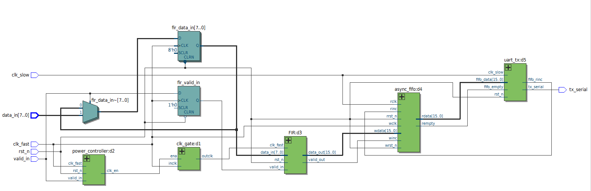

---

# RTL Design

## FIR Filter

The FIR filter uses four taps:

```text
Coefficients = [1, 2, 3, 4]
Input width  = 8 bits
Output width = 16 bits
```

The filter operates from the gated version of `clk_fast`.

## Asynchronous FIFO

The FIFO transfers 16-bit FIR results between the unrelated clock domains.

CDC protection includes:

- Independent read and write clocks
- Binary read/write pointers
- Binary-to-Gray pointer conversion
- Two-flip-flop pointer synchronizers
- Full and empty detection

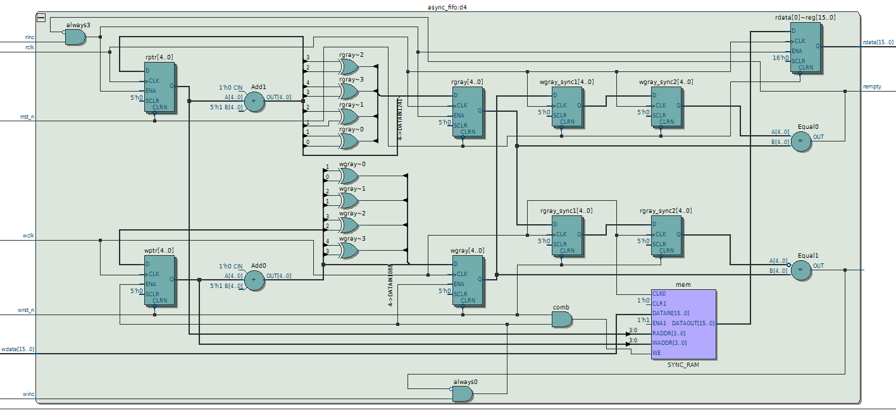

## UART Transmitter

The UART transmitter operates in the 10 MHz `clk_slow` domain and serializes FIFO data at 9600 baud.

## Power Controller

The power controller reduces switching activity in the FIR clock domain.

After 10 consecutive inactive `clk_fast` cycles, the FIR clock is disabled. A new valid input immediately requests clock reactivation.

Wake-up handling preserves the first sample arriving after an idle period.

---

# Clock Domain Crossing

The design intentionally contains two asynchronous clock domains.

Direct multi-bit transfer between these domains is avoided. The asynchronous FIFO forms the CDC boundary, while Gray-coded pointers are passed through two-stage synchronizers.

The clocks are declared asynchronous in SDC:

```tcl
set_clock_groups -asynchronous \
    -group [get_clocks {clk_fast}] \
    -group [get_clocks {clk_slow}]
```

This prevents invalid synchronous setup/hold analysis between the unrelated clock domains while timing each domain independently.

---

# FPGA Implementation

The original implementation targets:

```text
Intel Cyclone IV E
EP4CE115F29C7
```

The FPGA flow was performed using Intel Quartus Prime Lite.

## FPGA Clock Gating

The FPGA implementation uses Intel `ALTCLKCTRL` for glitch-free hardware clock gating.

```text
valid_in
   |
   v
Power Controller
   |
   v
clk_en
   |
   v
ALTCLKCTRL
   |
   v
gated_clk
   |
   v
FIR
```

A simple combinational clock gate such as:

```systemverilog
assign gated_clk = clk_fast & clk_en;
```

was intentionally avoided.

## Functional Verification

Individual SystemVerilog testbenches verify:

- FIR operation
- Power controller behavior
- Asynchronous FIFO
- UART transmitter
- Complete top-level data flow
- Clock shutdown after inactivity
- Clock wake-up
- Preservation of the first sample after wake-up

### Clock Gating Enabled

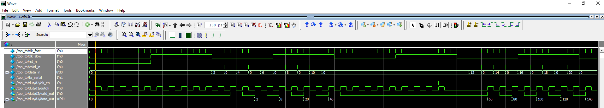

### Clock Gating Disabled

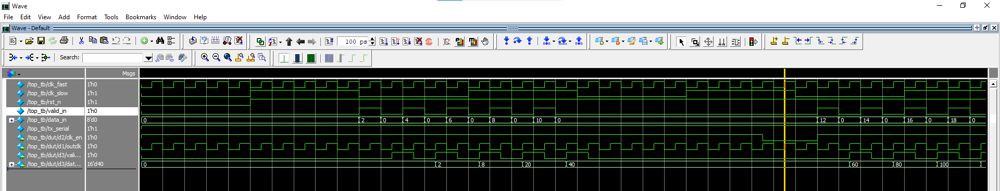

---

## FPGA Static Timing Analysis

Timing analysis was performed using Intel TimeQuest.

Final FPGA timing results:

```text
Worst Setup Slack = +1.450 ns
Worst Hold Slack  = +0.180 ns
Design-wide TNS   = 0 ns
```

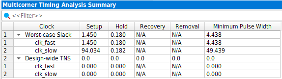

### Worst Setup Path

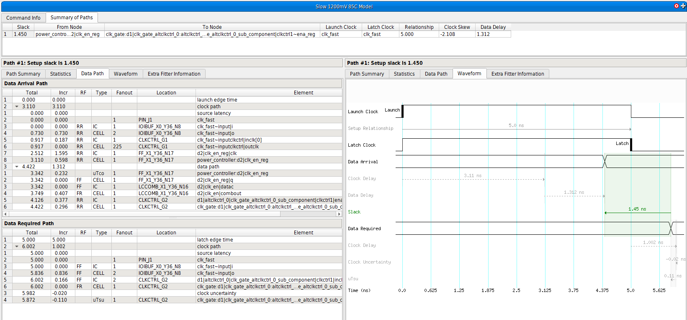

### Worst Hold Path

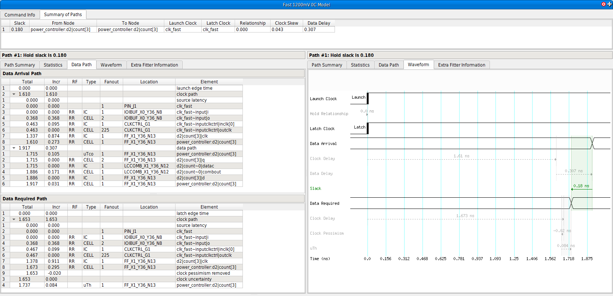

The FPGA timing environment intentionally did not assign arbitrary board-level input/output delays because no external synchronous-device timing specification was defined.

---

## FPGA Resource Utilization

| Resource | Usage |
|---|---:|
| Logic Elements | 445 / 114,480 |
| Registers | 336 |
| Pins | 13 |
| Embedded Memory Bits | 0 |
| DSP 9-bit Elements | 0 |
| PLLs | 0 |

The asynchronous FIFO is implemented using FPGA logic/registers rather than embedded memory, while the FIR coefficients are implemented without dedicated DSP blocks.

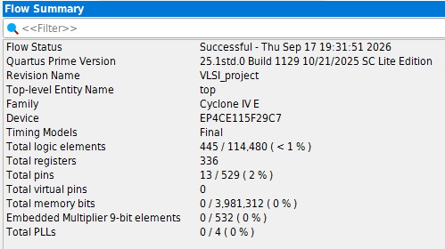

---

## FPGA Power Analysis

Quartus Power Analyzer was used to compare the same fitted design and stimulus with clock gating enabled and disabled.

```text
Clock Gating OFF:
Core Dynamic Power = 8.03 mW

Clock Gating ON:
Core Dynamic Power = 5.11 mW

Estimated Reduction = ~36.4%
```

### Clock Gating OFF

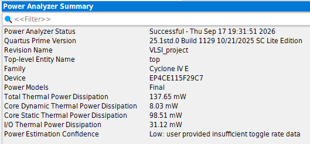

### Clock Gating ON

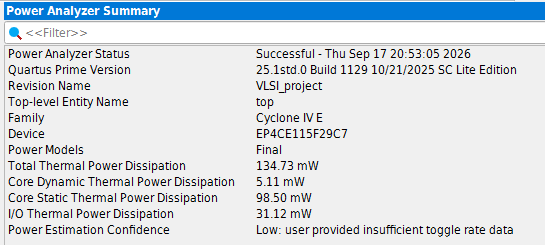

The result represents a comparative post-fit power estimate rather than a physical board measurement. Quartus reported limited power-estimation confidence because some internal activity was estimated vectorlessly.

---

# ASIC Physical Design

The RTL architecture was subsequently adapted for a complete ASIC Physical Design flow using:

- OpenLane 2
- OpenROAD
- Yosys
- OpenSTA
- KLayout
- Magic
- Netgen
- SKY130 PDK
- SKY130 HD standard-cell library

The implementation was taken from RTL through final GDSII.

```text
SystemVerilog RTL
        |
        v
     Synthesis
        |
        v
    Floorplanning
        |
        v
 Power Distribution
        |
        v
     Placement
        |
        v
Clock Tree Synthesis
        |
        v
   Timing Repair
        |
        v
   Global Routing
        |
        v
 Detailed Routing
        |
        v
Parasitic Extraction
        |
        v
Multi-Corner STA
        |
        v
 Physical Signoff
        |
        v
      GDSII
```

---

## FPGA-to-ASIC Clock-Gating Adaptation

The Intel `ALTCLKCTRL` primitive used by the FPGA implementation is device-specific and cannot be used in a standard-cell ASIC flow.

For the ASIC implementation, it was replaced with a SKY130 integrated clock-gating cell:

```text
sky130_fd_sc_hd__dlclkp_1
```

The clock-gating control behavior remains part of the RTL architecture, while the implementation uses a technology-appropriate glitch-free clock cell.

This also allows the gated FIR clock to participate correctly in clock-tree synthesis and static timing analysis.

---

# ASIC Timing Constraints

Two primary clocks are defined:

```tcl
create_clock -name clk_fast -period 10.000 [get_ports {clk_fast}]
create_clock -name clk_slow -period 100.000 [get_ports {clk_slow}]
```

The two domains are declared asynchronous.

For the ASIC implementation, explicit interface assumptions were introduced:

```text
Input delay minimum = 0.5 ns
Input delay maximum = 2.0 ns
Clock uncertainty   = 0.2 ns
```

These values are design assumptions for the portfolio implementation rather than measured board/interface specifications.

`rst_n` is an asynchronous reset and is intentionally not modeled as ordinary synchronous input data.

`tx_serial` is a protocol-driven UART serial output rather than an externally synchronous output and is intentionally excluded from synchronous output timing analysis.

The broad reset false-path approach was intentionally avoided so that reset-related timing behavior is not silently hidden.

---

# Floorplanning and Placement

The final ASIC implementation contains:

```text
Standard-cell instances = 1,838
Standard-cell area      = 18,630.4 um^2
Core utilization        = 61.06%
Macros                  = 0
```

Final die dimensions are approximately:

```text
186.585 um x 197.305 um
```

The design is implemented entirely using standard cells without embedded hard macros.

---

# Clock Tree Synthesis

CTS builds physical clock distribution networks for:

- `clk_fast`
- `clk_slow`
- Gated FIR clock

The clock tree uses inserted clock buffers/inverters to control clock latency, transition, fanout, and skew.

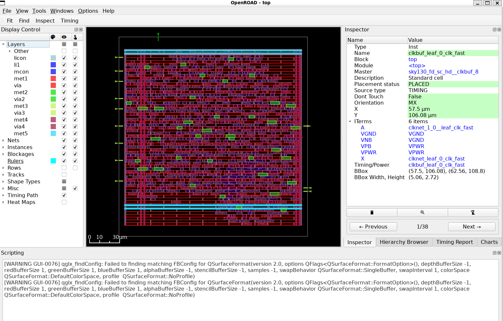

After CTS, hold analysis exposed short data paths that required repair. Timing-repair buffers were inserted automatically to increase minimum data-path delay while preserving setup timing.

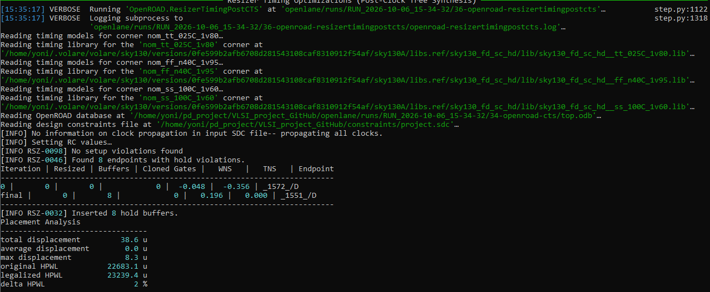

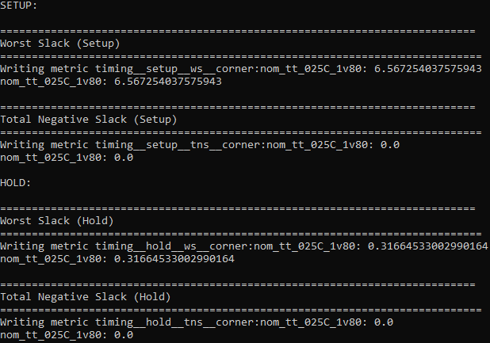

---

# Global Routing

Global routing determines coarse routing paths and evaluates routing-resource demand before exact wire geometry is generated.

The final routing process achieved zero global-routing overflow.

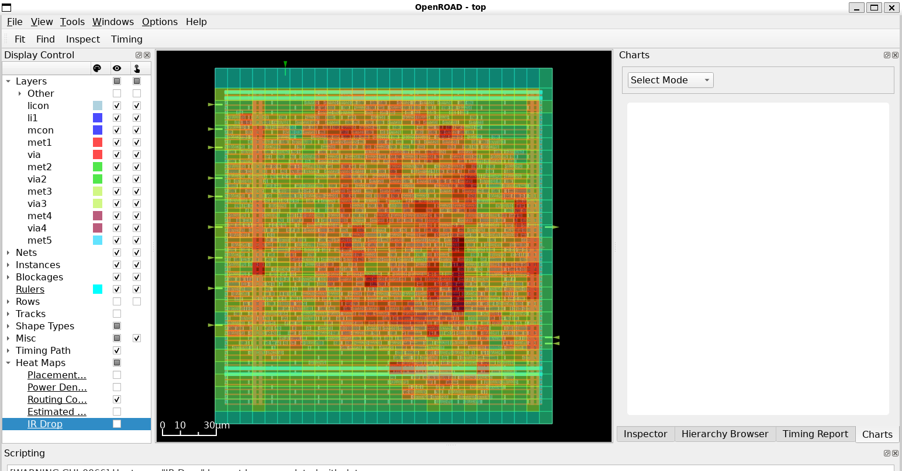

---

# Detailed Routing

Detailed routing assigns exact tracks, metal layers, and vias while satisfying physical design rules.

Routing-rule violations were iteratively repaired until the detailed router reached zero remaining violations.

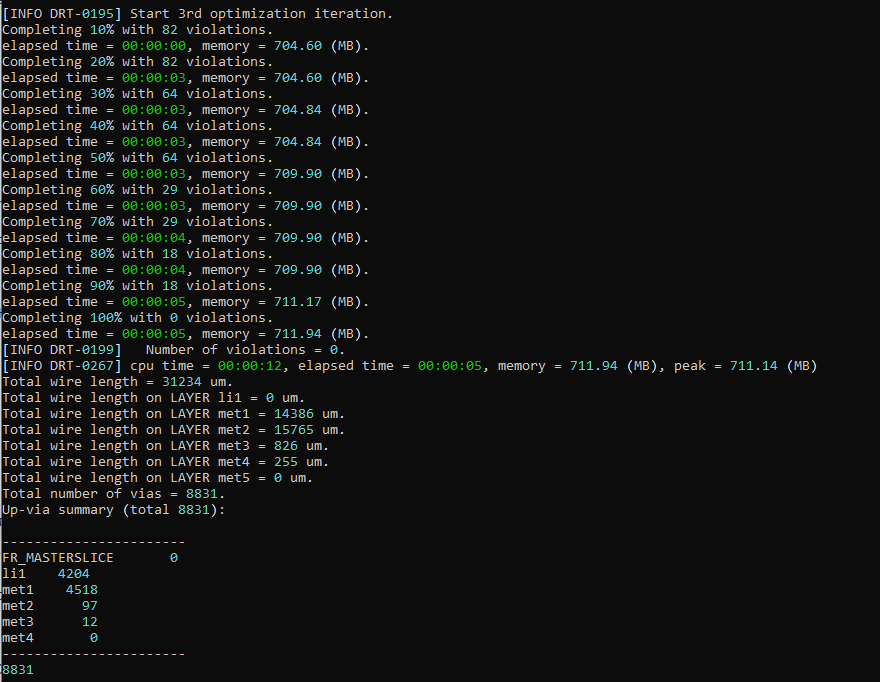

### Routed Metal Layers

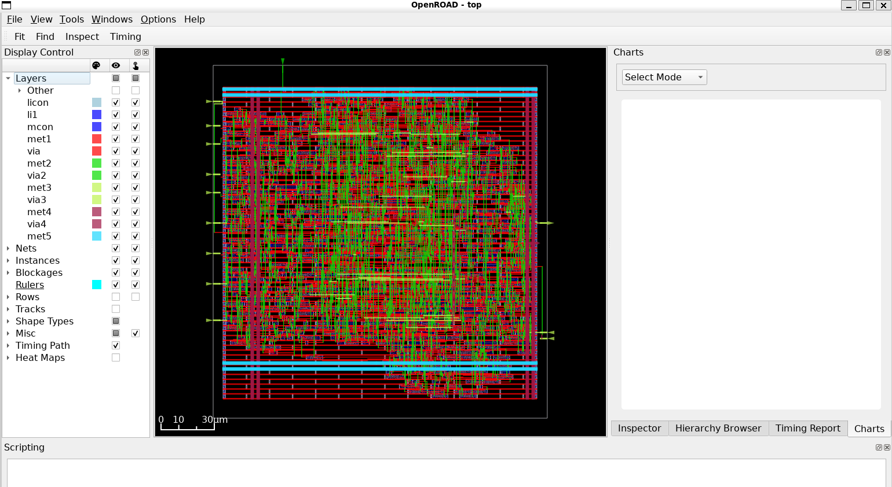

---

# Parasitic Extraction and Post-Route STA

After routing, interconnect resistance and capacitance were extracted and included in timing analysis.

Post-route timing was evaluated across nine PVT/RC analysis combinations.

Final worst-case results:

```text
Worst Setup Slack = +2.434 ns
Worst Hold Slack  = +0.088 ns

Setup TNS         = 0 ns
Hold TNS          = 0 ns

Setup Violations  = 0
Hold Violations   = 0

Max Slew Violations     = 0
Max Capacitance Violations = 0
```

Worst setup slack occurred in the slow timing corner, while worst hold slack occurred in the fast timing corner.

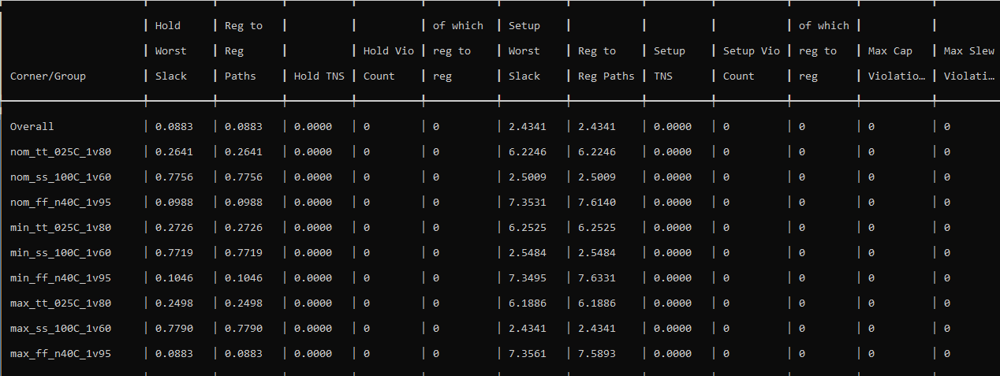

The final timing reports are available under:

```text
physical_design/reports/
```

---

# Physical Verification and Signoff

The final routed design completed physical verification successfully.

| Check | Final Result |
|---|---:|
| Magic DRC | 0 violations |
| KLayout DRC | 0 violations |
| Antenna | 0 net / pin violations |
| LVS | Circuits match uniquely |
| Layout XOR | 0 differences |
| Setup Violations | 0 |
| Hold Violations | 0 |
| Max Slew Violations | 0 |
| Max Capacitance Violations | 0 |

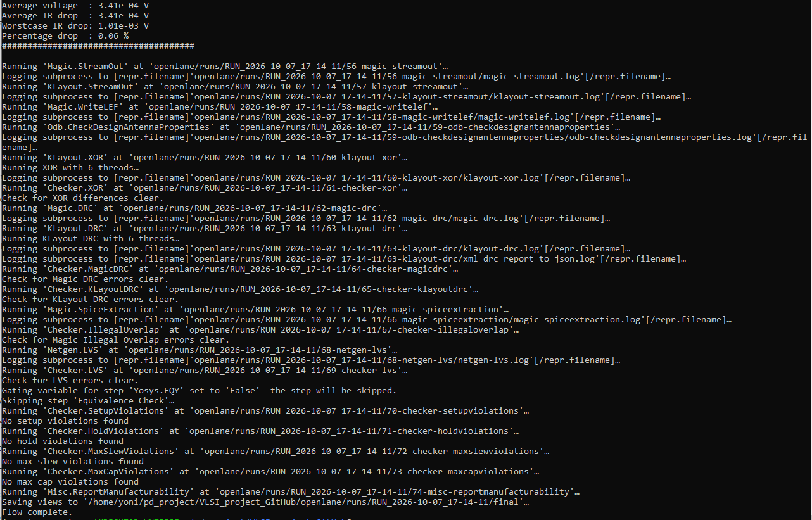

Selected signoff reports are preserved in:

```text
physical_design/reports/
```

---

# Final GDSII

The complete RTL-to-GDSII flow produced the final physical layout:

```text
physical_design/final/top.gds
```

### Routed Metal View

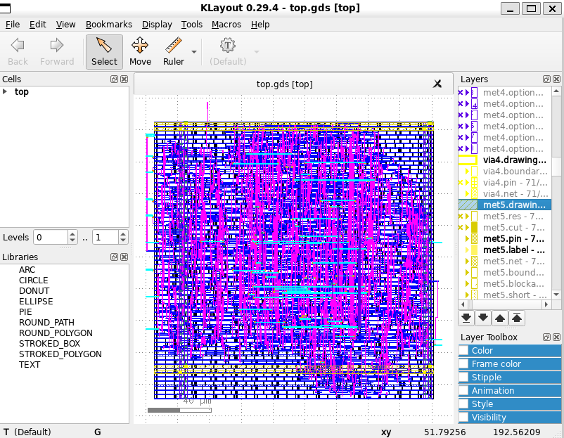

### Full Layout View

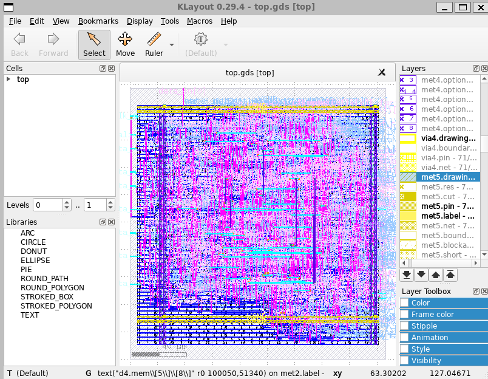

The final layout contains the placed standard cells, clock distribution, power distribution, signal routing, vias, and upper-metal interconnect generated by the physical design flow.

---

# Final ASIC Results

| Metric | Result |
|---|---:|
| Technology | SKY130 |
| Standard-Cell Library | SKY130 HD |
| Standard-Cell Instances | 1,838 |
| Sequential Cells | 333 |
| Integrated Clock Gates | 1 |
| Core Utilization | 61.06% |
| Die Area | 36,814.2 um^2 |
| Standard-Cell Area | 18,630.4 um^2 |
| Clock Buffers | 42 |
| Clock Inverters | 26 |
| Timing-Repair Buffers | 237 |
| Worst Setup Slack | +2.434 ns |
| Worst Hold Slack | +0.088 ns |
| Setup TNS | 0 ns |
| Hold TNS | 0 ns |
| DRC Violations | 0 |
| Antenna Violations | 0 |
| LVS | Clean |
| XOR Differences | 0 |

---

# Repository Structure

```text
.
├── constraints/
│   └── project.sdc
│
├── ip/
│   └── clk_gate.qsys
│
├── rtl/
│   ├── FIR.sv
│   ├── async_fifo.sv
│   ├── power_controller.sv
│   ├── top.sv
│   └── uart_tx.sv
│
├── rtl_asic/
│   ├── FIR.sv
│   ├── async_fifo.sv
│   ├── power_controller.sv
│   ├── top.sv
│   ├── uart_tx.sv
│   └── clk_gate.sv
│
├── tb/
│   ├── FIR_tb.sv
│   ├── async_fifo_tb.sv
│   ├── power_controller_tb.sv
│   ├── top_tb.sv
│   └── uart_tx_tb.sv
│
├── openlane/
│   └── config.json
│
├── physical_design/
│   ├── final/
│   │   └── top.gds
│   ├── images/
│   └── reports/
│
├── project_results/
│   ├── CLOCK_GATING_ON/
│   ├── CLOCK_GATING_OFF/
│   └── COMMON_DESIGN/
│
├── VLSI_project.qpf
├── VLSI_project.qsf
├── .gitignore
└── README.md
```

Generated OpenLane run directories are intentionally excluded from version control. Selected final reports, screenshots, configuration files, ASIC RTL, and the final GDSII are retained as portfolio artifacts.

---

# Tools and Technologies

### RTL and Verification

- SystemVerilog
- Questa Altera FPGA Starter Edition

### FPGA

- Intel Quartus Prime Lite
- Intel TimeQuest Timing Analyzer
- Quartus Power Analyzer
- Intel Platform Designer / Qsys

### ASIC Physical Design

- OpenLane 2
- OpenROAD
- Yosys
- OpenSTA
- SKY130 PDK
- KLayout
- Magic
- Netgen

### Constraints and Analysis

- Tcl
- SDC
- Static Timing Analysis
- Multi-clock timing
- Multi-corner timing analysis
- CDC
- Clock Tree Synthesis
- Timing closure
- Physical verification

---

# Key Engineering Topics Demonstrated

This project demonstrates practical experience with:

- SystemVerilog RTL design
- Digital signal-processing datapaths
- Multi-clock architecture
- Clock Domain Crossing
- Gray-code asynchronous FIFO design
- Two-flip-flop synchronizers
- UART communication
- Hardware clock gating
- FPGA-specific clock-control primitives
- ASIC integrated clock-gating cells
- Functional verification
- SDC timing constraints
- Static Timing Analysis
- Setup and hold analysis
- Synthesis
- Floorplanning
- Power distribution
- Standard-cell placement
- Clock Tree Synthesis
- Hold-time repair
- Global routing
- Congestion analysis
- Detailed routing
- Parasitic extraction
- Post-route multi-corner STA
- Timing closure
- DRC
- LVS
- Antenna checking
- GDSII generation

---

# Summary

This project began as a dual-clock FPGA streaming architecture and was extended into a complete ASIC Physical Design implementation.

The FPGA portion demonstrates RTL design, CDC, functional verification, timing analysis, hardware clock gating, and comparative power analysis.

The ASIC portion demonstrates a complete RTL-to-GDSII flow on SKY130, including synthesis, floorplanning, placement, CTS, routing, parasitic extraction, multi-corner post-route STA, timing closure, DRC, LVS, antenna verification, and final GDSII generation.

Final ASIC signoff achieved:

```text
Worst Setup Slack = +2.434 ns
Worst Hold Slack  = +0.088 ns
Setup TNS         = 0 ns
Hold TNS          = 0 ns

DRC Violations    = 0
Antenna Violations = 0
LVS               = Clean
XOR Differences   = 0

Final GDSII       = Generated
```# SystemVerilog Streaming System - FPGA Implementation & ASIC Physical Design

A complete digital design project developed from SystemVerilog RTL through two implementation flows:

- **FPGA implementation** targeting Intel Cyclone IV E using Quartus Prime
- **ASIC RTL-to-GDSII Physical Design** targeting SKY130 using OpenLane/OpenROAD

The design implements a dual-clock streaming system containing a 4-tap FIR filter, asynchronous FIFO for clock-domain crossing, UART transmitter, and dynamic clock gating.

The original design was synthesized, fitted, functionally verified, timing-analyzed, and power-analyzed as an FPGA implementation. The same RTL architecture was then adapted for an ASIC flow and taken through synthesis, floorplanning, placement, clock tree synthesis, routing, parasitic extraction, multi-corner static timing analysis, physical verification, and final GDSII generation.

---

## Project Highlights

| Area | Result |
|---|---|
| RTL | SystemVerilog |
| Clock Domains | 100 MHz / 10 MHz asynchronous clocks |
| CDC | Gray-coded asynchronous FIFO with 2-FF synchronizers |
| Signal Processing | 4-tap FIR filter |
| Communication | UART TX at 9600 baud |
| Power Optimization | Hardware clock gating |
| FPGA Target | Intel Cyclone IV E |
| ASIC Technology | SKY130 |
| ASIC Flow | OpenLane / OpenROAD |
| ASIC Standard-Cell Instances | 1,838 |
| ASIC Core Utilization | 61.06% |
| Post-Route Worst Setup Slack | +2.434 ns |
| Post-Route Worst Hold Slack | +0.088 ns |
| Setup / Hold TNS | 0 ns / 0 ns |
| Final DRC Violations | 0 |
| Antenna Violations | 0 |
| LVS | Clean |
| GDSII | Successfully generated |

---

## System Architecture

The system contains two asynchronous clock domains:

```text
clk_fast = 100 MHz
clk_slow = 10 MHz
```

Main data path:

```text
data_in / valid_in
        |
        v
  Wake-Up Handling
        |
        v
    4-Tap FIR
        |
        v
 Asynchronous FIFO
        |
        v
   UART Transmitter
        |
        v
    tx_serial
```

The FIR operates in the fast clock domain. Filtered samples are transferred safely into the slow clock domain through an asynchronous FIFO and are then transmitted by the UART.

### Top-Level RTL


---

# RTL Design

## FIR Filter

The FIR filter uses four taps:

```text
Coefficients = [1, 2, 3, 4]
Input width  = 8 bits
Output width = 16 bits
```

The filter operates from the gated version of `clk_fast`.

## Asynchronous FIFO

The FIFO transfers 16-bit FIR results between the unrelated clock domains.

CDC protection includes:

- Independent read and write clocks
- Binary read/write pointers
- Binary-to-Gray pointer conversion
- Two-flip-flop pointer synchronizers
- Full and empty detection


## UART Transmitter

The UART transmitter operates in the 10 MHz `clk_slow` domain and serializes FIFO data at 9600 baud.

## Power Controller

The power controller reduces switching activity in the FIR clock domain.

After 10 consecutive inactive `clk_fast` cycles, the FIR clock is disabled. A new valid input immediately requests clock reactivation.

Wake-up handling preserves the first sample arriving after an idle period.

---

# Clock Domain Crossing

The design intentionally contains two asynchronous clock domains.

Direct multi-bit transfer between these domains is avoided. The asynchronous FIFO forms the CDC boundary, while Gray-coded pointers are passed through two-stage synchronizers.

The clocks are declared asynchronous in SDC:

```tcl
set_clock_groups -asynchronous \
    -group [get_clocks {clk_fast}] \
    -group [get_clocks {clk_slow}]
```

This prevents invalid synchronous setup/hold analysis between the unrelated clock domains while timing each domain independently.

---

# FPGA Implementation

The original implementation targets:

```text
Intel Cyclone IV E
EP4CE115F29C7
```

The FPGA flow was performed using Intel Quartus Prime Lite.

## FPGA Clock Gating

The FPGA implementation uses Intel `ALTCLKCTRL` for glitch-free hardware clock gating.

```text
valid_in
   |
   v
Power Controller
   |
   v
clk_en
   |
   v
ALTCLKCTRL
   |
   v
gated_clk
   |
   v
FIR
```

A simple combinational clock gate such as:

```systemverilog
assign gated_clk = clk_fast & clk_en;
```

was intentionally avoided.

## Functional Verification

Individual SystemVerilog testbenches verify:

- FIR operation
- Power controller behavior
- Asynchronous FIFO
- UART transmitter
- Complete top-level data flow
- Clock shutdown after inactivity
- Clock wake-up
- Preservation of the first sample after wake-up

### Clock Gating Enabled


### Clock Gating Disabled


---

## FPGA Static Timing Analysis

Timing analysis was performed using Intel TimeQuest.

Final FPGA timing results:

```text
Worst Setup Slack = +1.450 ns
Worst Hold Slack  = +0.180 ns
Design-wide TNS   = 0 ns
```


### Worst Setup Path


### Worst Hold Path


The FPGA timing environment intentionally did not assign arbitrary board-level input/output delays because no external synchronous-device timing specification was defined.

---

## FPGA Resource Utilization

| Resource | Usage |
|---|---:|
| Logic Elements | 445 / 114,480 |
| Registers | 336 |
| Pins | 13 |
| Embedded Memory Bits | 0 |
| DSP 9-bit Elements | 0 |
| PLLs | 0 |

The asynchronous FIFO is implemented using FPGA logic/registers rather than embedded memory, while the FIR coefficients are implemented without dedicated DSP blocks.


---

## FPGA Power Analysis

Quartus Power Analyzer was used to compare the same fitted design and stimulus with clock gating enabled and disabled.

```text
Clock Gating OFF:
Core Dynamic Power = 8.03 mW

Clock Gating ON:
Core Dynamic Power = 5.11 mW

Estimated Reduction = ~36.4%
```

### Clock Gating OFF


### Clock Gating ON


The result represents a comparative post-fit power estimate rather than a physical board measurement. Quartus reported limited power-estimation confidence because some internal activity was estimated vectorlessly.

---

# ASIC Physical Design

The RTL architecture was subsequently adapted for a complete ASIC Physical Design flow using:

- OpenLane 2
- OpenROAD
- Yosys
- OpenSTA
- KLayout
- Magic
- Netgen
- SKY130 PDK
- SKY130 HD standard-cell library

The implementation was taken from RTL through final GDSII.

```text
SystemVerilog RTL
        |
        v
     Synthesis
        |
        v
    Floorplanning
        |
        v
 Power Distribution
        |
        v
     Placement
        |
        v
Clock Tree Synthesis
        |
        v
   Timing Repair
        |
        v
   Global Routing
        |
        v
 Detailed Routing
        |
        v
Parasitic Extraction
        |
        v
Multi-Corner STA
        |
        v
 Physical Signoff
        |
        v
      GDSII
```

---

## FPGA-to-ASIC Clock-Gating Adaptation

The Intel `ALTCLKCTRL` primitive used by the FPGA implementation is device-specific and cannot be used in a standard-cell ASIC flow.

For the ASIC implementation, it was replaced with a SKY130 integrated clock-gating cell:

```text
sky130_fd_sc_hd__dlclkp_1
```

The clock-gating control behavior remains part of the RTL architecture, while the implementation uses a technology-appropriate glitch-free clock cell.

This also allows the gated FIR clock to participate correctly in clock-tree synthesis and static timing analysis.

---

# ASIC Timing Constraints

Two primary clocks are defined:

```tcl
create_clock -name clk_fast -period 10.000 [get_ports {clk_fast}]
create_clock -name clk_slow -period 100.000 [get_ports {clk_slow}]
```

The two domains are declared asynchronous.

For the ASIC implementation, explicit interface assumptions were introduced:

```text
Input delay minimum = 0.5 ns
Input delay maximum = 2.0 ns
Clock uncertainty   = 0.2 ns
```

These values are design assumptions for the portfolio implementation rather than measured board/interface specifications.

`rst_n` is an asynchronous reset and is intentionally not modeled as ordinary synchronous input data.

`tx_serial` is a protocol-driven UART serial output rather than an externally synchronous output and is intentionally excluded from synchronous output timing analysis.

The broad reset false-path approach was intentionally avoided so that reset-related timing behavior is not silently hidden.

---

# Floorplanning and Placement

The final ASIC implementation contains:

```text
Standard-cell instances = 1,838
Standard-cell area      = 18,630.4 um^2
Core utilization        = 61.06%
Macros                  = 0
```

Final die dimensions are approximately:

```text
186.585 um x 197.305 um
```

The design is implemented entirely using standard cells without embedded hard macros.

---

# Clock Tree Synthesis

CTS builds physical clock distribution networks for:

- `clk_fast`
- `clk_slow`
- Gated FIR clock

The clock tree uses inserted clock buffers/inverters to control clock latency, transition, fanout, and skew.


After CTS, hold analysis exposed short data paths that required repair. Timing-repair buffers were inserted automatically to increase minimum data-path delay while preserving setup timing.


---

# Global Routing

Global routing determines coarse routing paths and evaluates routing-resource demand before exact wire geometry is generated.

The final routing process achieved zero global-routing overflow.


---

# Detailed Routing

Detailed routing assigns exact tracks, metal layers, and vias while satisfying physical design rules.

Routing-rule violations were iteratively repaired until the detailed router reached zero remaining violations.


### Routed Metal Layers


---

# Parasitic Extraction and Post-Route STA

After routing, interconnect resistance and capacitance were extracted and included in timing analysis.

Post-route timing was evaluated across nine PVT/RC analysis combinations.

Final worst-case results:

```text
Worst Setup Slack = +2.434 ns
Worst Hold Slack  = +0.088 ns

Setup TNS         = 0 ns
Hold TNS          = 0 ns

Setup Violations  = 0
Hold Violations   = 0

Max Slew Violations     = 0
Max Capacitance Violations = 0
```

Worst setup slack occurred in the slow timing corner, while worst hold slack occurred in the fast timing corner.


The final timing reports are available under:

```text
physical_design/reports/
```

---

# Physical Verification and Signoff

The final routed design completed physical verification successfully.

| Check | Final Result |
|---|---:|
| Magic DRC | 0 violations |
| KLayout DRC | 0 violations |
| Antenna | 0 net / pin violations |
| LVS | Circuits match uniquely |
| Layout XOR | 0 differences |
| Setup Violations | 0 |
| Hold Violations | 0 |
| Max Slew Violations | 0 |
| Max Capacitance Violations | 0 |


Selected signoff reports are preserved in:

```text
physical_design/reports/
```

---

# Final GDSII

The complete RTL-to-GDSII flow produced the final physical layout:

```text
physical_design/final/top.gds
```

### Routed Metal View


### Full Layout View


The final layout contains the placed standard cells, clock distribution, power distribution, signal routing, vias, and upper-metal interconnect generated by the physical design flow.

---

# Final ASIC Results

| Metric | Result |
|---|---:|
| Technology | SKY130 |
| Standard-Cell Library | SKY130 HD |
| Standard-Cell Instances | 1,838 |
| Sequential Cells | 333 |
| Integrated Clock Gates | 1 |
| Core Utilization | 61.06% |
| Die Area | 36,814.2 um^2 |
| Standard-Cell Area | 18,630.4 um^2 |
| Clock Buffers | 42 |
| Clock Inverters | 26 |
| Timing-Repair Buffers | 237 |
| Worst Setup Slack | +2.434 ns |
| Worst Hold Slack | +0.088 ns |
| Setup TNS | 0 ns |
| Hold TNS | 0 ns |
| DRC Violations | 0 |
| Antenna Violations | 0 |
| LVS | Clean |
| XOR Differences | 0 |

---

# Repository Structure

```text
.
├── constraints/
│   └── project.sdc
│
├── ip/
│   └── clk_gate.qsys
│
├── rtl/
│   ├── FIR.sv
│   ├── async_fifo.sv
│   ├── power_controller.sv
│   ├── top.sv
│   └── uart_tx.sv
│
├── rtl_asic/
│   ├── FIR.sv
│   ├── async_fifo.sv
│   ├── power_controller.sv
│   ├── top.sv
│   ├── uart_tx.sv
│   └── clk_gate.sv
│
├── tb/
│   ├── FIR_tb.sv
│   ├── async_fifo_tb.sv
│   ├── power_controller_tb.sv
│   ├── top_tb.sv
│   └── uart_tx_tb.sv
│
├── openlane/
│   └── config.json
│
├── physical_design/
│   ├── final/
│   │   └── top.gds
│   ├── images/
│   └── reports/
│
├── project_results/
│   ├── CLOCK_GATING_ON/
│   ├── CLOCK_GATING_OFF/
│   └── COMMON_DESIGN/
│
├── VLSI_project.qpf
├── VLSI_project.qsf
├── .gitignore
└── README.md
```

Generated OpenLane run directories are intentionally excluded from version control. Selected final reports, screenshots, configuration files, ASIC RTL, and the final GDSII are retained as portfolio artifacts.

---

# Tools and Technologies

### RTL and Verification

- SystemVerilog
- Questa Altera FPGA Starter Edition

### FPGA

- Intel Quartus Prime Lite
- Intel TimeQuest Timing Analyzer
- Quartus Power Analyzer
- Intel Platform Designer / Qsys

### ASIC Physical Design

- OpenLane 2
- OpenROAD
- Yosys
- OpenSTA
- SKY130 PDK
- KLayout
- Magic
- Netgen

### Constraints and Analysis

- Tcl
- SDC
- Static Timing Analysis
- Multi-clock timing
- Multi-corner timing analysis
- CDC
- Clock Tree Synthesis
- Timing closure
- Physical verification

---

# Key Engineering Topics Demonstrated

This project demonstrates practical experience with:

- SystemVerilog RTL design
- Digital signal-processing datapaths
- Multi-clock architecture
- Clock Domain Crossing
- Gray-code asynchronous FIFO design
- Two-flip-flop synchronizers
- UART communication
- Hardware clock gating
- FPGA-specific clock-control primitives
- ASIC integrated clock-gating cells
- Functional verification
- SDC timing constraints
- Static Timing Analysis
- Setup and hold analysis
- Synthesis
- Floorplanning
- Power distribution
- Standard-cell placement
- Clock Tree Synthesis
- Hold-time repair
- Global routing
- Congestion analysis
- Detailed routing
- Parasitic extraction
- Post-route multi-corner STA
- Timing closure
- DRC
- LVS
- Antenna checking
- GDSII generation

---

# Summary

This project began as a dual-clock FPGA streaming architecture and was extended into a complete ASIC Physical Design implementation.

The FPGA portion demonstrates RTL design, CDC, functional verification, timing analysis, hardware clock gating, and comparative power analysis.

The ASIC portion demonstrates a complete RTL-to-GDSII flow on SKY130, including synthesis, floorplanning, placement, CTS, routing, parasitic extraction, multi-corner post-route STA, timing closure, DRC, LVS, antenna verification, and final GDSII generation.

Final ASIC signoff achieved:

```text
Worst Setup Slack = +2.434 ns
Worst Hold Slack  = +0.088 ns
Setup TNS         = 0 ns
Hold TNS          = 0 ns

DRC Violations    = 0
Antenna Violations = 0
LVS               = Clean
XOR Differences   = 0

Final GDSII       = Generated
```
